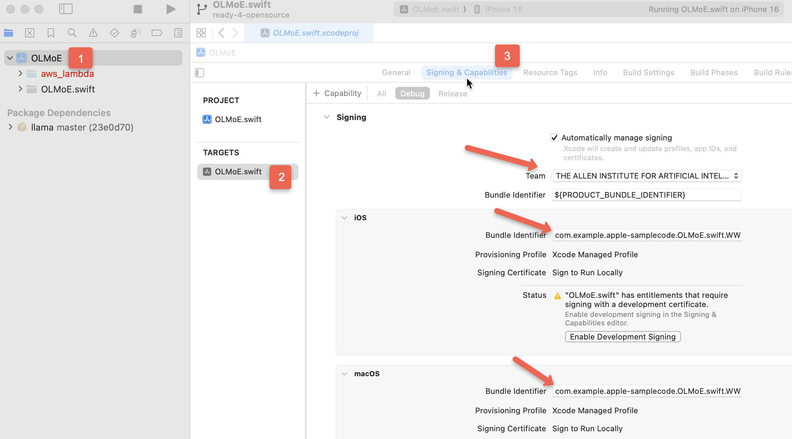
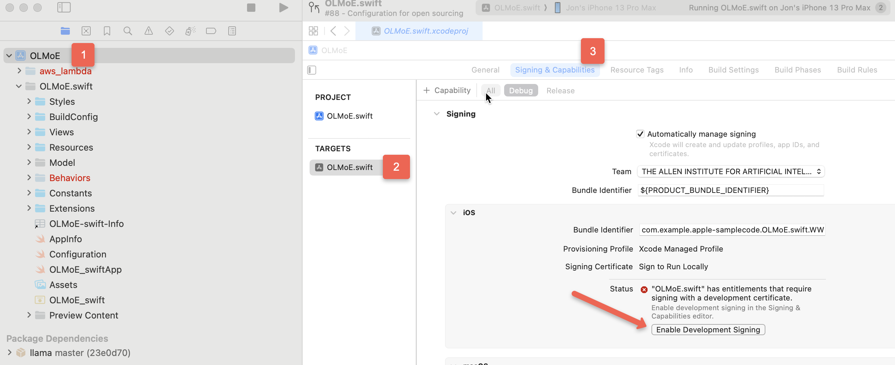

# OLMoE Swift

## Requirements

- Xcode 15.4+
- iOS 17+

## Configuration

1) Log in to [Apple Developer](https://developer.apple.com).
    To find the Team ID, see: [Locate your team ID](https://developer.apple.com/help/account/manage-your-team/locate-your-team-id/).

1) Follow and deploy the lambda function as described in the [lambda README](../aws-lambda/README.md)

1) Rename `BuildConfig/build.example.xcconfig` to `build.xcconfig`.

1) Populate the `build.xcconfig` file with your API key and endpoint.

    The `API_URL` should be the endpoint to access the lambda function.
    In our example, we used an AWS API Gateway endpoint that forwards requests to the lambda function.

    The `API_KEY` is the key to access the API Gateway endpoint.

    The `DEVELOPMENT_TEAM_ID` is your team ID you located in step 1.

    The `BUNDLE_VERSION` is the number used to identify the [current project version](https://developer.apple.com/documentation/xcode/build-settings-reference#Current-Project-Version) and the iteration of the [bundle version](https://developer.apple.com/documentation/bundleresources/information-property-list/cfbundleversion).

    The `BUNDLE_VERSION_PUBLIC` The [public version](https://developer.apple.com/documentation/bundleresources/information-property-list/cfbundleshortversionstring) number of the application and the [marketing version](https://developer.apple.com/documentation/xcode/build-settings-reference#Marketing-Version).

    The `PRODUCT_BUNDLE_IDENTIFIER` is the bundle identifier for the app.
    This can be assigned your unique identifier or the default value.

    ```ini
    API_KEY=your_api_key_here
    API_URL=api_url
    BUNDLE_VERSION=10
    BUNDLE_VERSION_PUBLIC=1.0.0.${BUNDLE_VERSION}
    DEVELOPMENT_TEAM_ID=your_team_id
    PRODUCT_BUNDLE_IDENTIFIER=com.example.apple-samplecode.OLMoE.swift.${DEVELOPMENT_TEAM_ID}
    ```

1) Open the project in Xcode.

1) Ensure the target device is set to an appropriate device (ie iPhone 15 Pro or higher)

    

1) Run the project

## Trouble-shooting

### Ensure the correct configuration is being used

1) Select the project in the Project Navigator.

1) In configurations ensure "Debug and Release" is set to use `build.xcconfig`

    

### Ensure the correct team is selected

1) In "Signing & Capabilities" ensure your correct team and bundle identifier match the ones in `build.xcconfig`

    

### Running on a physical device

1) Ensure the device is connected to your mac via USB.

1) In the Signing & Capabilities section, click on "Enable Development Signing"

    

1) Select your device in the device dropdown menu.

    

1) Run the project.
